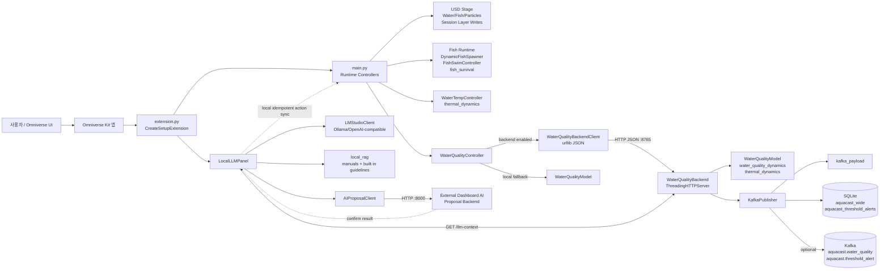
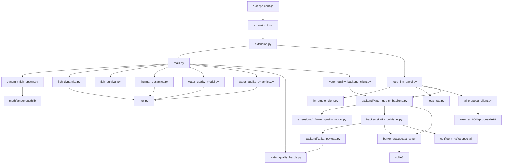
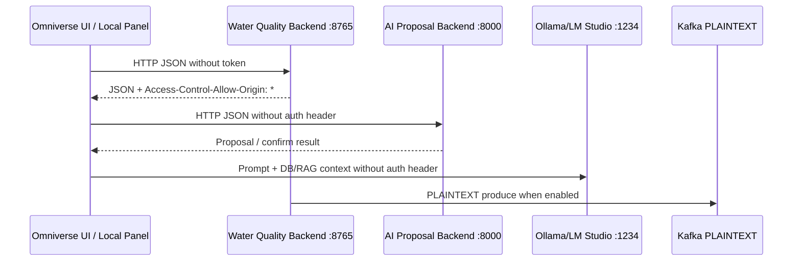

# Aquacast 저장소 심층 분석

작성일: 2026-06-14
분석 방식: `git ls-files` 기준 전체 tracked 파일 370개 스캔, `backend/`, `extensions/`, `docs/`, `tools/`, 루트 Kit 설정, Docker/Compose 설정, 테스트, `kit-app-template/` 템플릿, 캐시/상태성 tracked 파일 확인.
주의: 이 문서는 정적 코드 분석 기준이다. Omniverse/Kit 런타임과 외부 AI proposal backend는 현재 세션에서 직접 실행하지 않았다.

## 1. 전체 스캔 요약

Aquacast는 NVIDIA Omniverse Kit 확장, 수질 계산 백엔드, Kafka/SQLite 관측 계층, 로컬 LLM/AI proposal UI, 그리고 NVIDIA `kit-app-template` 체크아웃이 한 저장소 안에 같이 들어 있는 구조다. 실제 Aquacast 런타임 소스와 템플릿 원본을 구분해서 봐야 한다.

| 영역 | 주요 파일 | 역할 | 최신 관찰 |
|---|---|---|---|
| Kit 앱 설정 | `aquacast.aquacast_composer.kit`, `aquacast.aquacast_composer_streaming.kit`, `kit-app-template/source/apps/*.kit` | Omniverse 앱 실행 구성 | 루트와 `kit-app-template` 양쪽에 Aquacast kit 설정이 존재한다. |
| Kit 확장 진입점 | `extensions/aquacast.aquacast_composer_extensions/aquacast/aquacast_composer_extensions/extension.py` | `IExt` entrypoint, 메뉴/패널/대시보드 생성, 런타임 시작 | Tank Controls field sync, Actuator Overview, Metrics Dashboard가 여기서 관리된다. |
| Kit 런타임 로직 | `extensions/aquacast.aquacast_composer_extensions/main.py` | stage cache, fish, water temp, water quality, particle primvar, action API | `execute_water_quality_action()`이 UI/AI/외부 호출의 공용 제어 진입점이다. |
| 순수 모델 | `water_quality_model.py`, `water_quality_dynamics.py`, `thermal_dynamics.py`, `fish_dynamics.py`, `fish_survival.py`, `dynamic_fish_spawn.py`, `water_quality_bands.py` | Omniverse 없는 계산 로직 | plain pytest 대상이며 `tests/`가 별도로 존재한다. |
| 수질 백엔드 | `backend/water_quality_backend.py` | `ThreadingHTTPServer` JSON API, 탱크별 모델 상태, Kafka/SQLite 발행 트리거 | `/advance`, `/action`, `/reset`, `/snapshot`, `/sensor`, `/history`, `/llm-context` 등을 제공한다. |
| Kafka/DB 계층 | `backend/kafka_publisher.py`, `backend/kafka_payload.py`, `backend/aquacast_db.py` | Kafka payload 생성, 선택 발행, SQLite wide table 저장 | state publish 최소 간격 설정과 tank/sensor key dedupe가 있다. |
| Local LLM/AI proposal | `local_llm_panel.py`, `lm_studio_client.py`, `local_rag.py`, `ai_proposal_client.py` | LLM 질의, RAG/DB context, dashboard AI proposal inbox | `Generate Proposal`, `Confirm`, `Reject`, pending/recent 조회 UI가 Local LLM Panel에 있다. |
| 배포 | `backend/Dockerfile`, `backend/docker-compose.yml`, `backend/aquacast-backend.env`, `backend/Makefile` | backend/Kafka/Kafka UI/SQLite/SQLiteBrowser 로컬 스택 | compose는 Kafka PLAINTEXT, backend 8765, Kafka UI 8083, SQLiteBrowser 13000/13001을 공개한다. |
| 문서/설계 | `docs/`, `PERF_OPTIMIZATION_SPEC.md`, `CLAUDE.md`, `backend/README.md` | 설계 의도와 운영 문서 | 수질/열/동적 fish/Kafka 설계 문서가 분리되어 있다. |
| 템플릿/벤더성 파일 | `kit-app-template/` | NVIDIA Kit 앱 템플릿 checkout | 실제 런타임과 무관한 샘플/템플릿이 다수 포함된다. |
| 생성/상태 파일 | `.omc/state/`, `nv_shadercache/`, `backend/data/sqlite/*`, `__pycache__/` | 런타임 산출물 | 일부가 tracked 목록에 포함되어 있다. 소스 관리 경계 재정리가 필요하다. |

## 2. 아키텍처 다이어그램

## 3. 의존성 그래프

외부 의존성은 백엔드와 Kit 런타임으로 나뉜다. 백엔드 `requirements.txt`는 `numpy==2.4.6`, `confluent-kafka==2.14.0`을 고정한다. Omniverse 측은 `.kit`/`extension.toml`이 제공하는 `carb`, `omni.*`, `pxr` 모듈에 의존한다. Local LLM/AI proposal 클라이언트는 표준 라이브러리 `urllib` 기반이라 별도 HTTP client 패키지는 없다.

## 4. 요청 라이프사이클 추적

### 4.1 Kit 시작

1. `extension.py:on_startup()`이 stage open, menu layout, windows, runtime module load를 초기화한다.
2. `_load_aquacast_main_module()`은 `extensions/.../main.py`를 `importlib.util.spec_from_file_location`으로 직접 로드한다.
3. runtime module에서 `start_stage_structure_cache`, `start_dynamic_fish_spawner`, `start_fish_swim_controller`, `start_water_temp_controller`, `start_water_quality_controller`가 순차 실행된다.
4. `global_variable.py`는 runtime에서 계속 재로드되는 튜닝 파일이다. `WQ_UPDATE_INTERVAL_SECONDS`는 현재 `1.0`이다.
5. `WaterQualityController`는 backend health check에 성공하면 `WaterQualityBackendClient`를 사용하고, 실패하면 local model로 동작한다.

### 4.2 수질 업데이트와 Kafka/SQLite 발행

1. Kit update event마다 `WaterQualityController._on_update()`가 호출된다.
2. `WQ_UPDATE_INTERVAL_SECONDS`보다 짧으면 반환하고, 간격을 넘으면 `dt`를 계산한다.
3. backend mode에서는 `WaterQualityBackendClient.advance(dt)`가 `POST /advance`를 동기 호출한다.
4. backend는 root model과 tank-scoped model을 `WaterQualityModel.advance()`로 전진시킨다.
5. `KafkaPublisher.publish_state()`가 호출되어 센서 reading을 Kafka-shaped payload로 만들고 SQLite에 저장한다.
6. `AQUACAST_KAFKA_PUBLISH_INTERVAL_SECONDS` 기본값은 `1.0`이며, 1초보다 빠른 state publish는 skip한다.
7. tank-scoped reading이 있으면 default `tank-01:*` root reading은 발행 후보에서 제외한다. 같은 `(tank_id, sensor_name)` key는 한 tick에서 한 번만 발행한다.
8. Kafka가 활성화된 경우 `aquacast.water_quality`, threshold alert는 `aquacast.threshold_alert` topic으로 produce한다.
9. Kit 쪽은 반환 snapshot으로 temperature controller, fish survival, particle primvar/color를 갱신한다.

### 4.3 센서/대시보드 조회

1. Sensor UI는 `sample_water_quality_sensor()` 또는 `sample_water_temp_sensor()`를 호출한다.
2. backend mode에서는 `/sensor`, `/snapshot`, `/sensors`, `/particles/values`가 호출된다.
3. tank가 선택된 particle sensor는 USD stage의 sensor prim 주변 particle 값을 샘플링해 model reading 위에 평균값을 덮어쓴다.
4. Metrics Dashboard는 `get_quality_snapshot(tank_path=...)`을 주기적으로 호출하고 `water_quality_bands`로 healthy/warn/critical 상태를 계산한다.
5. Actuator Overview는 `inlet_enabled`, `outlet_enabled`, `biofilter_on`, `mechanical_filter_on`, `heater_on`을 dot indicator로 렌더링한다.

### 4.4 수질 제어 액션

1. Tank Controls UI, 메뉴 action, fish stock sync, 외부 코드가 `execute_water_quality_action(action, tank_path, **params)`를 호출한다.
2. `WaterQualityController.apply_control_action()`은 action 전 snapshot을 읽고, target tank model을 선택하거나 생성한다.
3. backend mode에서는 client가 `POST /action` 또는 `POST /reset`을 호출한다. local mode에서는 `WaterQualityModel.apply_control()`을 직접 호출한다.
4. 성공 결과에는 `control_values`가 붙는다. 이 값은 Omniverse controller/UI field가 실제 수행 결과로 재동기화하는 데 사용된다.
5. `set_temperature`는 water temperature controller와 tank particle temperature에도 동기화된다.
6. tank path 없는 전역 `set_inflow`는 water temperature controller inflow toggle도 동기화한다. tank-scoped `set_inflow`는 water-quality model만 바꾼다.
7. action 후 particle visual refresh가 강제되고 `[Aquacast WQ Control]` 로그에 before/after 변경 사항이 남는다.

현재 모델이 지원하는 action은 `feed`, `set_temperature`, `set_heater`, `set_inlet_temperature`, `set_water_exchange`, `set_inflow`, `set_biofilter`, `set_mechanical_filter`, `set_stock`, `set_inlet_salinity`, `set_inlet_turbidity`, `set_inlet_do`, `set_inlet_alkalinity`, `set_inlet_tan`, `set_aeration`, `set_co2_stripping`, `set_biofilter_capacity`, `set_nitrification_rate`, `dose_alkalinity`, `dose_salt`, `add_turbidity`, `oxygen_boost`, `co2_pulse`, `load_scenario`다.

### 4.5 AI proposal lifecycle

1. Local LLM Panel의 `Generate Proposal` 버튼은 `AIProposalClient.propose()`를 호출한다.
2. 요청 대상은 `AI_PROPOSAL_BACKEND_URL` 기본값 `http://127.0.0.1:8000`의 `POST /api/ai/actions/propose`다.
3. `Refresh Pending`은 `GET /api/ai/actions/pending?limit=N`, `Refresh Recent`는 `GET /api/ai/actions/recent?limit=N`을 호출한다.
4. proposal row에는 `proposal_id`, `status`, `risk_level`, `summary`, 최대 5개 action 요약이 표시된다.
5. `Confirm`은 `POST /api/ai/actions/{proposal_id}/confirm`에 `{operator: omniverse, note: ...}`를 보낸다.
6. confirm 결과의 `executions` 중 `status=applied`인 항목은 local sync allowlist에 포함된 경우 `execute_water_quality_action()`으로 다시 동기화한다.
7. local sync allowlist는 `set_temperature`, `set_heater`, `set_inlet_temperature`, `set_water_exchange`, `set_inflow`, inlet chemistry, biofilter/filter, stock, scenario 등 idempotent 계열 action 중심이다. 누적형 feed/boost/dose/pulse는 중복 적용 위험 때문에 자동 sync 대상이 아니다.
8. `Reject`는 `POST /api/ai/actions/{proposal_id}/reject`를 호출하고 pending list를 새로고침한다.

중요한 현재 상태: proposal 생성 자체는 여전히 외부 proposal backend가 담당한다. Omniverse는 `Generate Proposal` 직전에 `/llm-context`를 읽어 row count/latest/alert count를 로그로 남기지만, 외부 backend 내부에서 SQL을 읽었는지는 이 client만으로 검증할 수 없다.

### 4.6 Local LLM/RAG lifecycle

1. `Run Once` 또는 polling loop가 prompt, model URL, interval을 읽는다.
2. `LOCAL_LLM_INCLUDE_WQ_DB_CONTEXT`가 true이면 `/llm-context`를 호출해 SQLite summary/context text를 prompt에 붙인다.
3. `ENABLE_LOCAL_LLM_RAG`가 true이면 `local_rag.py`가 manuals file과 built-in guideline을 paragraph chunk로 나누고 term overlap 기반 top-k를 붙인다.
4. `LMStudioClient`는 Ollama native `/api/generate` 또는 OpenAI-compatible `/v1/chat/completions`를 호출하도록 설계되어 있다.
5. `LocalLLMPanel._call_lm_studio()`는 RAG/DB context를 붙인 뒤 `LMStudioClient.chat()`을 호출한다.

## 5. 데이터베이스 접근 패턴

SQLite는 기본 활성화다. `AQUACAST_DB_DISABLED`가 truthy가 아니면 `KafkaPublisher` 생성 시 `WideMessageStore`가 열리고 WAL mode가 적용된다.

### 5.1 쓰기 경로

| 단계 | 함수 | 동작 |
|---|---|---|
| payload 생성 | `kafka_payload.build_message()` | sensor별 measurement subset, `actuators`, optional `tank_path`, reference measurements를 만든다. |
| state 저장 | `WideMessageStore.insert_kafka_message()` | `RLock`으로 단일 SQLite connection을 보호하고 commit한다. |
| wide merge | `aquacast_db.insert_kafka_message()` | 같은 `(tank_id, event_time_ms)` payload를 한 row로 병합한다. |
| actuator 저장 | `ACTUATOR_STATE_COLUMNS` | `inflow_enabled`, `inlet_enabled`, `outlet_enabled`, `biofilter_on`, `mechanical_filter_on`, `heater_on`, `flow_lph`, `q_makeup_lph`, `heater_power_w`, `turbidity_settle_h`를 저장한다. |
| alert 저장 | `insert_threshold_alert()` | threshold violation payload를 `alert_id` unique 기준으로 저장한다. |

Kafka가 비활성화되어도 SQLite 저장은 기본 활성이다. 즉 Kafka producer는 선택 사항이지만 DB write path는 backend state publish의 기본 부수효과다.

### 5.2 읽기 경로

| Endpoint | 함수 | 반환 성격 |
|---|---|---|
| `GET /history` | `query_recent_wide()` + `dashboard_rows_from_wide()` | dashboard alias row 목록 |
| `GET /threshold-alerts` | `query_recent_threshold_alerts()` | decoded alert row 목록 |
| `GET /llm-context` | `build_llm_context_payload()` | latest, summary, recent sample, threshold alerts, `context_text` |
| Local LLM panel | `_water_quality_db_context()` | `/llm-context` 결과 text를 prompt에 포함 |

읽기 connection은 `row_factory=sqlite3.Row`와 가능하면 `PRAGMA query_only=ON`을 사용한다. limit은 `_safe_limit()`으로 상한이 있다.

### 5.3 스키마와 인덱스

| 테이블 | 핵심 컬럼 | 제약/인덱스 |
|---|---|---|
| `aquacast_wide` | topic, source, tank_id, tank_path, sensor boolean columns, event_time/event_time_ms, seq, sim_time_h, measurement columns, actuator columns, payload_json | `UNIQUE(tank_id, event_time_ms)`, `idx_event_time_ms`, `idx_tank_time` |
| `aquacast_threshold_alerts` | alert_id, event_type, severity, tank_id, tank_name, tank_path, event_time_ms, violations_json, thresholds_json, measurements_json, stock_json, loads_json, payload_json | `alert_id UNIQUE`, `idx_event_time_ms`, `idx_tank_time`, `idx_event_type` |

Schema migration은 `_ensure_schema_columns()`가 부족한 sensor/measurement/actuator column을 `ALTER TABLE ADD COLUMN`으로 보강하는 방식이다. 삭제/타입 변경 migration은 없다.

### 5.4 데이터 보존과 운영상 위험

- retention, compaction, vacuum 정책이 없다.
- `payload_json`은 같은 tick의 sensor payload 배열을 계속 누적한다.
- 장시간 실행하면 `backend/data/sqlite/aquacast.db`, `-wal`, `-shm`이 계속 증가할 수 있다.
- tracked 목록에 SQLite runtime 파일과 cache 파일이 포함되어 있어 운영 데이터가 Git diff/배포 artifact로 섞일 위험이 있다.

## 6. 인증 흐름

현재 Aquacast 자체의 애플리케이션 레벨 인증/인가 흐름은 없다.

| 인터페이스 | 현재 인증 상태 | 영향 |
|---|---|---|
| Water Quality Backend | token/session 없음 | `/action`, `/reset`, `/thresholds`를 누구나 호출 가능할 수 있다. |
| CORS | `Access-Control-Allow-Origin: *` | 임의 브라우저 origin에서 로컬 backend 호출 가능성이 있다. |
| AI Proposal Backend client | auth header 없음 | `:8000`이 외부 노출되면 proposal 생성/confirm/reject가 보호되지 않는다. |
| Local LLM server | auth 없음 | 외부 URL 지정 시 DB/RAG context가 외부 서버로 전송된다. |
| Kafka | compose PLAINTEXT | 로컬 개발 외 환경에서는 도청/위조 위험이 있다. |
| Kafka UI / SQLiteBrowser | 별도 앱 인증 설정 없음 | 포트 공개 시 메시지/DB 조회 UI가 노출된다. |
| Omniverse UI action | Kit 사용자 세션에 의존 | Aquacast 내부 role/permission check는 없다. |

권장 인증 흐름은 개발/운영 모드 분리다. 개발은 loopback 중심으로 두고, 외부 바인딩 시 API key 또는 mTLS, CORS allowlist, Kafka SASL/TLS, proposal backend auth, SQLiteBrowser 비활성화 또는 인증 프록시가 필요하다.

## 7. 기술 부채 분석

1. `main.py`가 4천 줄 이상이며 stage 탐색, fish, 수온, 수질, particle visual, action logging, CSV persistence가 한 파일에 있다. controller별 모듈 분리가 필요하다.
2. `global_variable.py`가 실시간 재로드되는 단일 설정 파일 역할을 하며 타입 검증이 약하다. 운영/개발 설정 경계도 불명확하다.
3. `local_llm_panel.py`에 proposal UI, LLM chat, DB context, RAG, log UI가 한 클래스에 섞여 있다.
4. proposal confirm local sync는 idempotent action 중심 allowlist로 제한된다. 누적형 action은 중복 적용을 피하기 위해 자동 동기화하지 않는다.
5. 외부 proposal backend가 어떤 SQL/LLM prompt/schema를 쓰는지 이 저장소에는 구현이 없어, `LLM json output validation failed` 같은 proposal 생성 실패의 근본 원인을 여기서 직접 검증하기 어렵다.
6. backend는 `ThreadingHTTPServer`와 수작업 routing이다. API surface가 커졌으므로 validation, auth, structured logging, error schema를 수작업으로 계속 유지해야 한다.
7. broad `except Exception`이 많아 UI 안정성은 높지만 오류 관측성이 낮다.
8. `kit-app-template/`와 실제 source가 같은 저장소에 있어 ownership과 분석 범위가 혼동된다.
9. runtime 산출물(`.omc/state`, `nv_shadercache`, SQLite DB/WAL/SHM, `__pycache__`)이 tracked 목록에 있어 재현성과 보안에 불리하다.
10. `ai_proposal_client.py`는 외부 proposal backend contract에 의존하지만 이 저장소 안에는 해당 backend 구현/스키마 검증이 없다.

## 8. 성능 병목

1. Kit update thread에서 backend HTTP 호출을 동기 수행한다. `WQ_BACKEND_TIMEOUT_SECONDS=0.25`로 짧지만 backend 지연이 UI frame loop에 영향을 줄 수 있다.
2. `/advance`마다 모델 advance, 모든 sensor reading, DB write, threshold 검사, optional Kafka produce가 함께 실행된다.
3. Kafka publish interval은 1초로 제한됐지만 SQLite writer는 publish path에 붙어 있어 state publish가 발생할 때마다 commit 비용이 있다.
4. particle values/primvar update는 positions/weights 배열, numpy 계산, USD authoring이 결합되어 particle 수 증가에 민감하다.
5. fish flocking은 벡터화되어도 전체 pairwise neighbor 성격이 있어 fish 수 증가 시 CPU/메모리 비용이 증가한다.
6. Stage traversal fallback이 여러 기능에서 사용된다. topology cache/json이 꺼져 있거나 stage가 크면 반복 탐색 비용이 커진다.
7. SQLite `payload_json` 누적과 JSON decode는 dashboard/LLM context 조회 시 I/O와 CPU 비용을 늘린다.
8. Local LLM panel은 UI rebuild를 자주 예약하고, proposal/LLM 응답 전문을 Console에 warning으로 남긴다. 긴 응답/대량 proposal에서 UI와 로그 비용이 커질 수 있다.
9. `WaterQualityModel.advance()`는 `time_scale`과 `substep_h`에 따라 substep 수가 증가한다. 큰 `dt`나 큰 `time_scale`은 한 요청 내 계산량을 늘린다.

## 9. 보안 우려

1. backend state-changing endpoint에 인증이 없다.
2. `backend/aquacast-backend.env`는 `AQUACAST_BACKEND_HOST=0.0.0.0`을 기본으로 둔다. compose/단독 실행에서 의도치 않은 네트워크 노출 가능성이 있다.
3. CORS `*`는 로컬 브라우저 기반 CSRF 유사 호출을 쉽게 만든다.
4. AI proposal backend URL은 사용자 입력 가능하며 auth가 없다. confirm/reject 호출이 외부 서버에 그대로 전송된다.
5. Local LLM prompt에는 SQLite context와 RAG 문서 내용이 포함될 수 있다. 서버 URL이 외부면 운영 데이터가 유출될 수 있다.
6. Local LLM/Proposal 로그가 Omniverse Console에 남는다. proposal action payload와 confirm result JSON이 민감정보를 포함할 경우 세션 로그에 남는다.
7. Kafka/Kafka UI/SQLiteBrowser compose 포트가 로컬 host에 공개된다. 개발용 전제 밖에서는 방화벽/인증이 필요하다.
8. Kafka는 PLAINTEXT listener다. TLS/SASL이 없다.
9. SQLite DB와 WAL/SHM이 소스 트리에 존재한다. 실제 운영 데이터가 Git에 섞일 위험이 있다.
10. thresholds file, fish CSV, RAG manuals path 등 파일 경로 기반 쓰기/읽기 기능에 allowlist가 없다.

## 10. 테스트와 검증 상태

| 계층 | 테스트 파일 | 커버리지 성격 |
|---|---|---|
| water quality model/dynamics | `extensions/.../tests/test_water_quality_model.py`, `test_water_quality_dynamics.py` | model step, sensor reading, time scale, control action, thermal coupling |
| thermal | `test_thermal_dynamics.py` | heat flux, RK4, heater direction |
| fish math/spawn/survival | `test_fish_dynamics.py`, `test_dynamic_fish_spawn.py`, `test_fish_survival.py` | 순수 math, spawn utility, survival state |
| backend DB/Kafka | `backend/tests/test_aquacast_db.py`, `test_kafka_payload.py`, `test_kafka_publisher.py`, `test_water_quality_backend.py` | payload shape, wide merge, publisher interval/key dedupe, tank-scoped backend state |
| Kit-hosted | `aquacast/.../tests/test_app_startup.py`, `test_app_extensions.py` | Omniverse extension load/startup |

부족한 검증 영역은 HTTP server concurrency, auth/CORS 정책, Docker compose 통합, Kafka broker 장애, proposal backend contract, proposal confirm 후 모든 action의 local sync, Local LLM chat 실제 호출, 장시간 SQLite retention, 대형 USD stage 성능이다.

## 11. 우선순위 권장 사항

1. 외부 AI proposal backend의 prompt, SQL query, JSON schema validation 실패 로그를 이 저장소와 연결 가능한 contract/test로 문서화한다.
2. AI proposal confirm 결과의 누적형 action은 중복 적용을 피하면서 local UI를 동기화할 별도 state refresh/ack protocol을 둔다.
3. backend와 proposal backend에 API key header, CORS allowlist, write endpoint 보호를 추가한다.
4. `AQUACAST_BACKEND_HOST` 기본값을 `127.0.0.1`로 낮추고 공개 배포는 별도 profile로 분리한다.
5. `main.py`를 `water_quality_controller.py`, `water_temp_controller.py`, `fish_runtime.py`, `stage_topology.py`, `particle_visuals.py`로 분리한다.
6. SQLite retention/compaction 정책을 추가한다. 예: 최근 N시간 또는 N행 보존, 주기적 vacuum, DB size metric.
7. runtime 산출물과 DB 파일을 `.gitignore`와 Git index에서 정리한다.
8. Kit update loop의 동기 HTTP를 worker/cache 기반으로 옮겨 UI frame blocking을 줄인다.
9. Kafka/SQLiteBrowser/Kafka UI를 개발 compose profile로 분리하고 운영 기본값에서는 비활성화한다.
10. 루트 `README.md`에 실제 런타임 경계, 실행 방법, 외부 backend/LLM/proposal 전제, 보안 주의사항을 통합한다.
