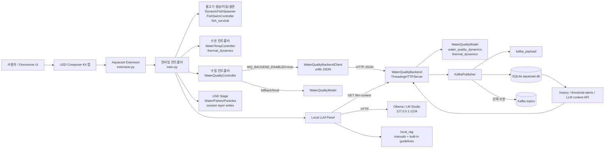
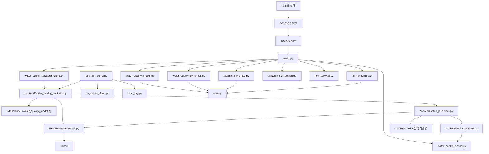

# Aquacast 저장소 심층 분석

작성일: 2026-06-14  
분석 범위: 저장소 루트 전체 파일 목록, `backend/`, `extensions/`, `tools/`, `docs/`, 루트 Kit 설정, Docker/Compose 설정, 테스트, 템플릿/캐시성 디렉터리

## 1. 전체 스캔 요약

Aquacast는 NVIDIA Omniverse Kit 기반 디지털 트윈 확장과 별도 로컬 수질 계산 백엔드로 나뉜다. 핵심 런타임 경계는 다음과 같다.

| 영역 | 주요 파일 | 역할 |
|---|---|---|
| Kit 앱 설정 | `aquacast.aquacast_composer.kit`, `aquacast.aquacast_composer_streaming.kit` | Omniverse 앱 의존성, 확장 폴더, 창/렌더러/메뉴 설정 |
| Kit 확장 진입점 | `extensions/aquacast.aquacast_composer_extensions/aquacast/aquacast_composer_extensions/extension.py` | `on_startup`/`on_shutdown`, 메뉴/패널/대시보드 생성, 런타임 컨트롤러 시작 |
| Kit 런타임 로직 | `extensions/aquacast.aquacast_composer_extensions/main.py` | 물고기 생성/이동, 수온/수질 컨트롤러, USD stage 탐색 및 primvar 쓰기 |
| 순수 모델 | `water_quality_model.py`, `water_quality_dynamics.py`, `thermal_dynamics.py`, `fish_dynamics.py`, `fish_survival.py`, `dynamic_fish_spawn.py`, `water_quality_bands.py` | Omniverse 없는 계산 로직과 단위 테스트 대상 |
| 수질 백엔드 | `backend/water_quality_backend.py` | `ThreadingHTTPServer` 기반 JSON API, 탱크별 모델 상태, Kafka/SQLite 발행 트리거 |
| Kafka/DB 계층 | `backend/kafka_publisher.py`, `backend/kafka_payload.py`, `backend/aquacast_db.py` | 센서 payload 생성, Kafka 선택 발행, SQLite wide table 저장 및 LLM 컨텍스트 조회 |
| 배포 | `backend/Dockerfile`, `backend/docker-compose.yml`, `backend/aquacast-backend.env` | Python 백엔드, Kafka, Kafka UI, SQLite, SQLiteBrowser 로컬 스택 |
| 문서/설계 | `docs/`, `PERF_OPTIMIZATION_SPEC.md`, `CLAUDE.md` | 기존 기능 설계와 운영 시나리오 기록 |
| 템플릿/벤더성 파일 | `kit-app-template/` | NVIDIA Kit 앱 템플릿 원본 및 샘플. 실제 Aquacast 런타임과 구분 필요 |
| 생성/상태 파일 | `__pycache__/`, `nv_shadercache/`, `.omc/state/`, `backend/data/sqlite/*` | 런타임 산출물. 저장소에 포함되어 있으나 소스 분석/배포 관리상 분리 권장 |

## 2. 아키텍처 다이어그램

## 3. 의존성 그래프

외부 의존성은 두 층으로 나뉜다. 백엔드 `requirements.txt`는 `numpy==2.4.6`, `confluent-kafka==2.14.0`만 고정한다. Omniverse 쪽은 `.kit`과 `extension.toml`에서 `omni.ui`, `omni.usd`, `omni.kit.*`, `pxr`, `carb` 등 Kit 런타임이 제공하는 모듈에 의존한다.

## 4. 요청 라이프사이클 추적

### 4.1 Kit 시작

1. `extension.py:on_startup`이 설정 객체를 초기화하고 자동 stage 열기, 메뉴/창 생성, 개발 자동 리로드 설정을 수행한다.
2. `_load_aquacast_main_module()`로 `main.py`를 로드한 뒤 `start_stage_structure_cache`, `start_dynamic_fish_spawner`, `start_fish_swim_controller`, `start_water_temp_controller`, `start_water_quality_controller`를 순차 실행한다.
3. `main.py`는 `global_variable.py`를 파일 mtime 기반으로 재로드하며 런타임 플래그를 읽는다.
4. `WaterQualityController.start()`는 모델을 로드하고 Kit update event stream에 `_on_update`를 구독한다.

### 4.2 수질 프레임 업데이트

1. Kit update event가 발생하면 `WaterQualityController._on_update`가 `WQ_UPDATE_INTERVAL_SECONDS` 간격으로 실행된다.
2. 백엔드 사용 시 `WaterQualityBackendClient.advance(dt)`가 `POST /advance`를 동기 HTTP 호출한다. 기본 타임아웃은 `0.25s`다.
3. 백엔드는 `WaterQualityBackend.advance()`에서 루트 모델과 탱크별 모델을 전진시키고 snapshot을 만든다.
4. 같은 요청 처리 중 `KafkaPublisher.publish_state()`가 호출되어 모든 센서 reading을 Kafka payload로 만들고 SQLite에 저장한다. Kafka는 환경변수로 활성화된 경우에만 produce한다.
5. Kit 컨트롤러는 반환된 상태로 수온 컨트롤러 값, fish survival, particle color/primvar를 갱신한다.

중요한 점은 Kafka/SQLite 발행이 `/advance` 요청의 부수효과라는 것이다. Kit가 멈추거나 `WQ_UPDATE_INTERVAL_SECONDS` 루프가 멈추면 Kafka/SQLite 시계도 함께 멈춘다.

### 4.3 센서/대시보드 조회

1. UI 패널은 `WaterQualityController.sample_sensor()` 또는 `snapshot()`을 호출한다.
2. 백엔드 사용 시 `GET /sensor`, `GET /snapshot`, `GET /sensors`, `GET /thresholds`가 호출된다.
3. particle sensor는 stage의 센서 prim 주변 particle 값을 샘플링해 모델 reading 위에 평균값을 덮어쓴다.
4. 메트릭 대시보드는 `water_quality_bands` 기준으로 healthy/warn/critical 상태를 계산하고 UI label/frame 색을 갱신한다.

### 4.4 제어 액션

1. UI 버튼 또는 fish stock sync가 `execute_water_quality_action` 계열을 통해 `WaterQualityController.apply_control_action()`을 호출한다.
2. 액션 payload에는 `type`, 선택적 `tank_path`, 파라미터가 포함된다.
3. 백엔드 사용 시 `POST /action` 또는 `POST /reset`으로 전달된다.
4. `WaterQualityModel.apply_control()`은 feed, water exchange, inflow, heater, biofilter, stock, scenario, temperature 등 상태/파라미터를 즉시 반영한다.
5. 성공 후 Kit는 수온 컨트롤러와 particle visual을 재동기화한다.

### 4.5 LLM 컨텍스트 요청

1. `LocalLLMPanel._run_once()`가 prompt를 구성한다.
2. `LOCAL_LLM_INCLUDE_WQ_DB_CONTEXT`가 true이면 `GET /llm-context`를 호출한다.
3. 백엔드는 SQLite wide rows와 threshold alerts를 조회해 summary, latest, recent sample, context text를 만든다.
4. `local_rag.py`는 로컬 문서 파일을 paragraph chunk로 나누고 단순 term overlap으로 top-k를 붙인다.
5. 최종 prompt를 Ollama native API 또는 OpenAI-compatible `/v1/chat/completions`로 보낸다.

## 5. 데이터베이스 접근 패턴

SQLite는 기본적으로 활성화되어 있다. `AQUACAST_DB_DISABLED`가 truthy가 아니면 `KafkaPublisher` 생성 시 `WideMessageStore`가 만들어지고 WAL 모드가 설정된다.

### 5.1 쓰기 경로

- `KafkaPublisher.publish_state()`가 각 센서 reading마다 `kafka_payload.build_message()`를 호출한다.
- `WideMessageStore.insert_kafka_message()`는 `RLock`으로 단일 connection을 보호하고 commit한다.
- `aquacast_db.insert_kafka_message()`는 `(tank_id, event_time_ms)`가 같은 센서 메시지를 `aquacast_wide` 한 행으로 병합한다.
- 각 센서별 boolean column과 canonical measurement column을 업데이트한다.
- threshold violation은 `aquacast_threshold_alerts`에 `alert_id` unique upsert로 저장된다.

### 5.2 읽기 경로

- `GET /history`는 `query_recent_wide()` 후 `dashboard_rows_from_wide()`로 alias 컬럼을 만든다.
- `GET /threshold-alerts`는 JSON 문자열 컬럼을 decode해서 반환한다.
- `GET /llm-context`는 recent rows, alert rows, metric summary, recent sample, `context_text`를 한 payload로 만든다.
- 읽기 connection은 `row_factory=sqlite3.Row`와 `PRAGMA query_only=ON`을 사용한다.

### 5.3 스키마와 인덱스

- `aquacast_wide`: 센서별 boolean, `event_time_ms`, `seq`, `sim_time_h`, 수질 measurement columns, `payload_json`.
- unique key: `(tank_id, event_time_ms)`.
- indexes: `event_time_ms`, `(tank_id, event_time_ms)`.
- `aquacast_threshold_alerts`: severity, event type, measurements/thresholds/loads JSON, payload JSON.
- indexes: `event_time_ms`, `(tank_id, event_time_ms)`, `event_type`.

### 5.4 관찰된 위험

- `payload_json`은 같은 tick의 센서 payload 배열을 누적한다. 센서 수가 늘어나거나 고주파로 동작하면 행 크기와 DB 파일 크기가 빠르게 증가할 수 있다.
- 저장소 내 `backend/data/sqlite/aquacast.db`, WAL/SHM 파일이 존재한다. 운영 데이터는 소스 관리 대상에서 제외하는 편이 안전하다.
- DB retention/compaction 정책이 없다. 장시간 Kit 실행 시 파일이 계속 증가한다.

## 6. 인증 흐름

현재 애플리케이션 레벨 인증 흐름은 구현되어 있지 않다.

| 인터페이스 | 현재 상태 | 영향 |
|---|---|---|
| 수질 HTTP 백엔드 | 인증/인가 없음. 모든 endpoint가 token 없이 동작 | `0.0.0.0:8765`로 바인딩되면 네트워크 접근자가 reset/action/threshold 변경 가능 |
| CORS | `Access-Control-Allow-Origin: *` | 브라우저 기반 임의 origin에서 로컬 백엔드 호출 가능 |
| Kafka | compose가 PLAINTEXT listener 사용 | 네트워크 경계 밖 배포 시 메시지 도청/위조 위험 |
| SQLiteBrowser | `13000`, `13001` 노출. compose 설정에 별도 앱 인증 없음 | 로컬 외부 노출 시 DB 조회/조작 위험 |
| Local LLM | token 없이 `127.0.0.1:1234` 호출 | 기본 로컬 전제에서는 편리하지만, URL을 외부 서버로 바꾸면 prompt/DB context가 전송됨 |
| Omniverse UI 액션 | Kit 내부 UI 이벤트 기반 | 사용자 권한 모델은 Omniverse 런타임에 의존하며 Aquacast 자체 권한 검사는 없음 |

권장 인증 흐름은 최소한 개발/운영 모드를 분리하는 것이다. 로컬 개발은 현재처럼 loopback 중심으로 두되, `0.0.0.0` 또는 Docker 포트 공개 시에는 API key header, CORS allowlist, Kafka SASL/TLS, SQLiteBrowser 비활성화 또는 인증 프록시를 추가해야 한다.

## 7. 기술 부채 분석

1. `main.py`가 4천 줄 이상이며 stage 탐색, fish UI, 수온, 수질, particle visual, CSV persistence, 생존 모델이 한 파일에 섞여 있다. 기능 추가 시 회귀 범위가 커진다.
2. `global_variable.py`가 설정, 임계값, 색상, 로컬 LLM, fish species, 파일 경로를 모두 담고 있으며 런타임 재로드까지 한다. 타입 검증과 환경별 override 경계가 약하다.
3. `sys.path` 삽입과 `importlib.reload()`가 여러 곳에 있다. 개발 중 반영은 쉽지만 패키징/테스트/중복 모듈 로딩 문제를 만들 수 있다.
4. 백엔드가 표준 라이브러리 `ThreadingHTTPServer`로 직접 라우팅한다. API surface가 커진 상태에서는 요청 validation, middleware, auth, structured logging을 수작업으로 계속 늘려야 한다.
5. 일부 broad `except Exception`이 오류를 숨긴다. UI 안정성에는 유리하지만 잘못된 stage path, DB 실패, backend sync 실패를 조기에 발견하기 어렵다.
6. 런타임 산출물(`__pycache__`, `nv_shadercache`, `.omc/state`, SQLite DB)이 저장소 파일 목록에 있다. 재현성과 diff 품질을 떨어뜨린다.
7. `kit-app-template/`가 대량 포함되어 실제 Aquacast 소스와 템플릿 원본이 섞인다. 신규 기여자가 ownership을 구분하기 어렵다.
8. 루트 `README.md`는 거의 비어 있고 상세 정보가 `backend/README.md`와 여러 설계 문서에 분산되어 있다.

## 8. 성능 병목

1. Kit update thread에서 동기 HTTP 호출을 수행한다. 타임아웃은 짧지만 백엔드 지연이 누적되면 UI frame loop에 영향을 준다.
2. `/advance`마다 모든 센서 reading을 만들고 DB insert를 수행한다. Kafka가 비활성화되어도 SQLite write는 기본 활성화이므로 I/O 비용이 남는다.
3. particle registration과 field update는 positions/weights 전체를 백엔드로 보내거나 USD primvar array를 쓴다. particle 수 증가 시 HTTP payload, numpy 계산, USD authoring 비용이 동시에 증가한다.
4. fish flocking은 `fish_dynamics.compute_flock_vectors()`로 벡터화되어 있지만 기본적으로 전체 fish 간 neighbor 계산이다. fish 수가 크게 늘면 메모리와 CPU가 증가한다.
5. stage 탐색은 여러 컨트롤러에서 `stage.Traverse()` fallback을 사용한다. StageStructureCache가 꺼져 있거나 topology JSON을 쓰지 않으면 대형 USD stage에서 반복 비용이 커진다.
6. SQLite wide row의 `payload_json` 누적과 threshold JSON 컬럼은 편리하지만 대시보드/LLM 조회에서 decode 비용과 I/O가 증가한다.
7. `WaterQualityModel.advance()`는 `substep_h` 기준으로 substep을 나눈다. `time_scale`이나 update interval이 커지면 한 요청 내 계산량이 증가한다.

## 9. 보안 우려

1. 백엔드 endpoint에 인증이 없고 `POST /action`, `POST /reset`, `POST /thresholds`가 상태 변경을 허용한다.
2. 기본 env 파일은 백엔드를 `0.0.0.0`에 바인딩한다. 단독 실행/compose 환경에서 의도치 않은 네트워크 노출 가능성이 있다.
3. CORS가 `*`이므로 로컬 브라우저 페이지가 백엔드에 요청을 보낼 수 있다.
4. Kafka compose 설정은 PLAINTEXT다. 로컬 개발 외에는 TLS/SASL 없이 사용하면 안 된다.
5. SQLiteBrowser가 compose에 포함되고 포트가 공개된다. 운영 compose에는 제외하거나 인증 경계를 둬야 한다.
6. Local LLM prompt에는 SQLite 수질 context와 RAG 문서 내용이 포함될 수 있다. 서버 URL을 외부로 바꾸면 운영 데이터가 외부 LLM 서버로 전송된다.
7. `local_rag.py`는 설정된 로컬 파일을 읽어 prompt에 넣는다. 경로 설정 권한이 넓으면 의도하지 않은 파일 내용이 LLM 로그/요청으로 노출될 수 있다.
8. Local LLM 패널은 요청/응답을 Omniverse Console에 warning으로 기록한다. 민감한 운영 데이터가 세션 로그에 남을 수 있다.
9. thresholds file 쓰기와 fish population CSV 쓰기가 경로 설정에 의해 결정된다. 운영 환경에서는 쓰기 가능한 경로 allowlist가 필요하다.

## 10. 테스트와 검증 상태

테스트는 비교적 좋은 편이지만 경계가 뚜렷하다.

- 백엔드: Kafka payload shape, SQLite wide merge/migration/LLM context, 탱크별 backend 상태 분리를 pytest로 검증한다.
- 순수 모델: water quality dynamics/model, thermal dynamics, fish dynamics, fish spawn, fish survival을 plain pytest로 검증한다.
- Omniverse 확장: Kit startup/extensions load async test가 있다.
- 부족한 영역: 실제 HTTP server concurrency, CORS/auth 정책, Docker compose 통합, Kafka broker 장애, 장시간 SQLite retention, Local LLM prompt leakage, 대형 USD stage 성능 테스트.

## 11. 우선순위 권장 사항

1. 로컬 개발 전용과 외부 노출 가능 모드를 분리한다. `AQUACAST_BACKEND_HOST=127.0.0.1`을 기본으로 바꾸고, 공개 모드에서는 API key와 CORS allowlist를 요구한다.
2. 런타임 산출물과 DB 파일을 `.gitignore`로 명확히 제외하고 저장소에서 제거한다.
3. `main.py`를 controller별 모듈로 분리한다. 우선 `water_quality_controller.py`, `fish_runtime.py`, `stage_topology.py`, `particle_visuals.py` 정도가 자연스러운 절단점이다.
4. SQLite retention 정책을 추가한다. 예: 최근 N시간 또는 N행 보존, vacuum/compact 운영 명령.
5. Kit update loop의 HTTP 호출을 비동기 worker 또는 최신 snapshot cache 기반으로 옮겨 frame loop blocking을 줄인다.
6. Local LLM 패널에는 “DB context 포함” 명시 토글, URL allowlist, 로그 길이/민감정보 마스킹을 추가한다.
7. compose의 Kafka/SQLiteBrowser는 개발 profile로 분리하고 운영 profile에서는 기본 비활성화한다.
8. 루트 README를 보강해 실제 런타임 경계, 실행 방법, 데이터 저장 위치, 보안 전제를 한 곳에서 설명한다.
